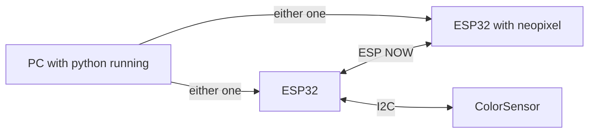

This program is not important to the final project. This produces a spectrometer that lights up an led with a sensed color.

It uses two ESP32, one with color sensor attached and the other with neopixel (rgb LED). 

The color sensor ESP32 would send XYZ values to the other ESP32, which would try to replicate the same color on its neopixel LED.

After flashing both ESP32 with their python programs and powering both boards you end up with a spectrometer.

