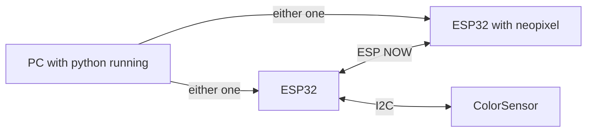

This programes is not important.

It uses two ESP32, one with color sensor attached and one with neopixel. 

The color sensor ESP32 would send XYZ values to the other ESP32, which would try to replicate the same color on its neopixel LED.

Connecting either one ESP32 to the computer and runs the python programe after setting up all the com port stuff gives you a spectrometer

