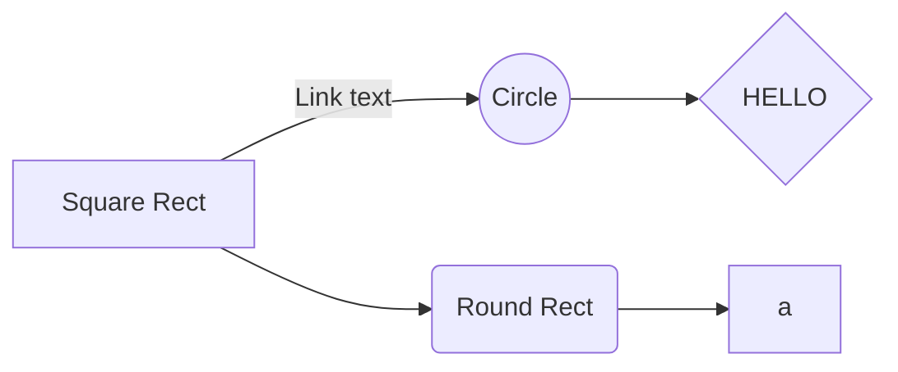

# LESA_OccupancyUnit (BLE_MeshLightingPRFNode)

Based on STM's *BLE_MeshLightingPRFNode* example, this project gets data from the ToF and color sensor. Bluetooth functionality has not been fully developed

### Overview

## How to use
In order to use this project you must download this entire repository and open the `.project` file in the STM32CubeIDE folder:

|  |  |
|--|--|
| This is how the files should be placed in the workspace folder | Open the project by clicking the .project file |

## Sensor related files

##### VL53L8CX (TOF Sensor)

    app_tof.c  ->  /BLE_MeshLightingPRFNode/Application/Core/app_tof.c

    - void MX_TOF_Init(void)
  
      : Initialize the TOF sensor. Validates whether it is properly connected and starts the sensor
  
    - static void MX_VL53L8CX_SimpleRanging_Process(void)
  
      : Read and print out the data if the sensor is properly running
  
    - void MX_TOF_ToggleReso(void)
  
      : A public function that calls toggle_resolution. Change the resolution of TOF sensor
  
    You can change the ranging frequency by modifying "RANGING_FREQUENCY" public variable(Set to 20Hz in the code)

    *custom_ranging_sensor.c  ->  /BLE_MeshLightingPRFNode/Application/Core/custom_ranging_sensor.c

    - int32_t CUSTOM_RANGING_SENSOR_Start(uint32_t Instance, uint8_t Mode)
  
      : Start the TOF sensor
  
    - int32_t CUSTOM_RANGING_SENSOR_Stop(uint32_t Instance)
  
      : Stop the TOF sensor

##### TCS3430 (Tristimulus Sensor)

    TCS3430.h  ->  /BLE_MeshLightingPRFNode/Drivers/BSP/TCS3430/TCS3430.h
 
    - Includes all the address of the registers of TCS3430
    
    - Includes Prototype of functions

    - struct tcs3430_optics_val

        : Has X,Y,Z, and IR values

    - struct tcs3430

        reginfo -> data in the registers

        XYZinfo -> Low & High byte of X, Y, Z, and IR1

    TCS3430.c  ->  /BLE_MeshLightingPRFNode/Drivers/BSP/TCS3430/TCS3430.c

    ............

Above two functions are necessary whenever you change the setting of the TOF(such as frequency of configure mode)
// TODO: Add set up tutoriald

Reference:

https://wiki.st.com/stm32mcu/wiki/Connectivity:STM32WB_BLE_MESH_Sensor_Model#/media/File:Connectivity_sensor-demo12.png

Summer Team Contact Information:

•	link10@rpi.edu 

•	kims29@rpi.edu 

•	zhengj8@rpi.edu

